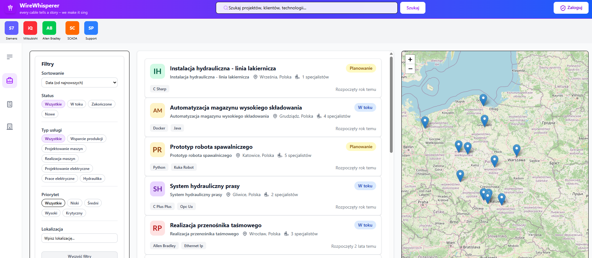
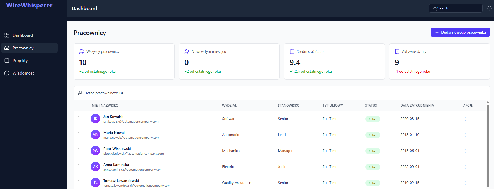
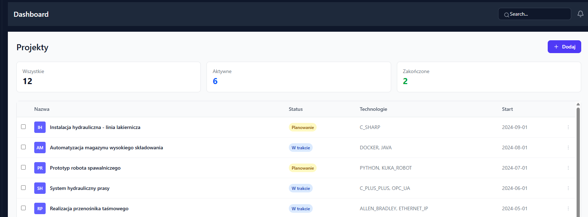
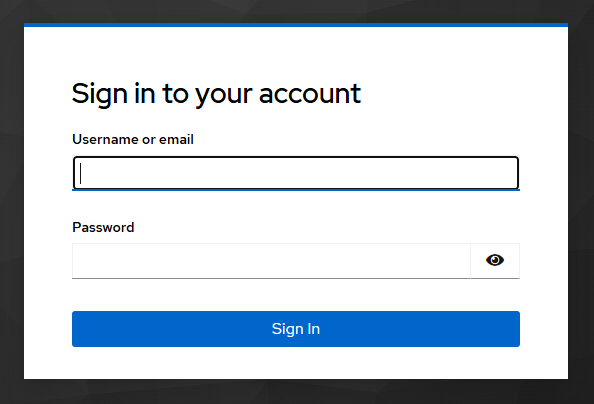

# 🚀 Automation Company Manager — Microservices Architecture (Educational Project)

A full-stack application designed to explore and understand **microservices architecture** using a realistic company management scenario.

The system simulates an automation company environment and demonstrates how modern backend systems are structured using **Spring Cloud**, **event-driven communication**, and **secure authentication flows**.

> ⚠️ This project is educational — some implementations are intentionally simplified to focus on architectural concepts.

---

## 🧠 Project Goals

- Design and implement a **microservices-based system**
- Understand **service-to-service communication**
- Explore **Spring Cloud ecosystem**
- Apply **DDD-inspired modular design**
- Build a **real-world backend architecture**

---

## 🏗️ System Architecture

The system is structured into three main layers:

### 1. Frontend
- Angular application acting as a client
- Communicates via API Gateway
- Type-safe integration using OpenAPI

### 2. Infrastructure Layer

Handles cross-cutting concerns:

- **Config Server** — centralized configuration  
- **Service Registry (Eureka)** — service discovery  
- **API Gateway** — single entry point  
- **Keycloak** — authentication & authorization  

### 3. Business Services

Each microservice is:

- Independently deployable  
- Focused on a single domain  
- Built with a consistent internal structure:
  - Controller
  - Service layer
  - Repository
  - DTOs & Mappers
  - Exception handling

---

## 🔧 Services Overview

### 👷 Employee Service
- Employee management  
- Built with **Spring MVC (blocking)**  

### 📁 Project Service
- Project & task management  
- Built with **Spring WebFlux (reactive)**  

### 📢 Notification Service
- Handles system notifications  
- Prepared for **event-driven communication (Kafka)**  

### 📦 Common Domain
- Shared models  
- Reusable components  

---

## 🔄 Communication

- **Synchronous:** REST via API Gateway  
- **Asynchronous:** Apache Kafka (event-driven)  

---

## 🔐 Security

- Authentication via **Keycloak**
- OAuth2 Resource Server + JWT
- Frontend integration using Keycloak Angular

---

## 🗄️ Configuration Management

- Centralized configuration via Config Server  
- Environment-based configs (`dev` / `prod`)  
- Externalized configuration per service  

---

## 🖼️ Application UI

### 🧭 Main Dashboard
Central overview of the system with access to core modules.  


---

### 👷 Employee Management
Manage employees and organizational structure.  


---

### 📁 Project Management
Handle projects and tasks using a reactive service.  


---

### 🔐 Authentication (Keycloak)
Secure login powered by OAuth2 and JWT.  


---

## ⚙️ Technology Stack

### Backend
- Java 17  
- Spring Boot  
- Spring Web (REST) & WebFlux  
- Spring Security (OAuth2 + JWT)  
- Keycloak  
- Spring Data JPA (Hibernate)  
- Flyway  
- Spring Cloud (Config Server, Eureka, Gateway)  
- Apache Kafka  
- MapStruct  
- Lombok  
- SpringDoc OpenAPI  
- Spring Boot Actuator  

### Frontend
- Angular 20  
- Tailwind CSS  
- RxJS  
- Chart.js  
- Keycloak Angular  
- OpenAPI Generator  

### Infrastructure & DevOps
- Docker & Docker Compose  
- Maven  
- PostgreSQL  
- H2 (dev profile)  

---

## 🚀 Getting Started

### Prerequisites

- Java 17+  
- Node.js 18+  
- Docker & Docker Compose  

---

### Run the application

```bash
# clone repository
git clone https://github.com/your-username/your-repo.git

cd your-repo

# start infrastructure & services
docker-compose up --build